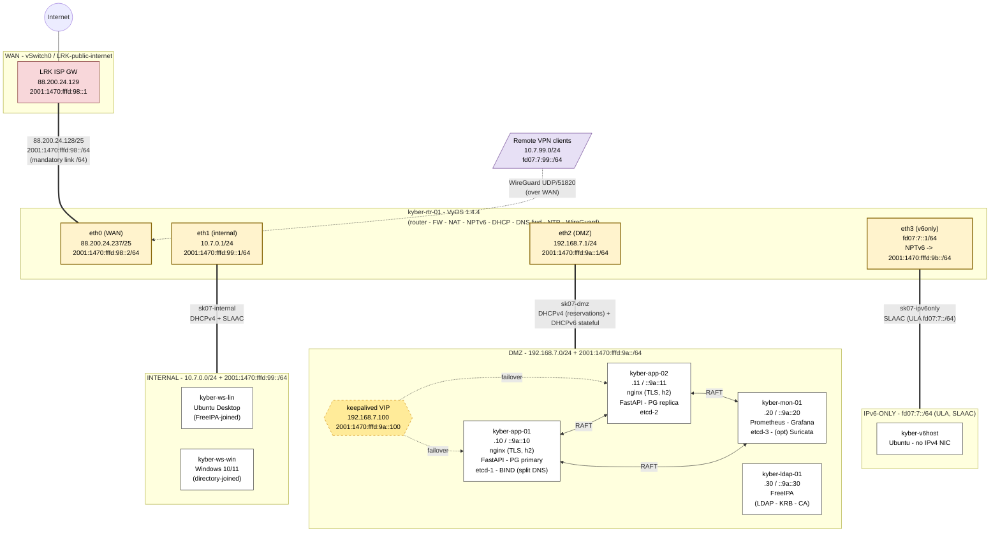
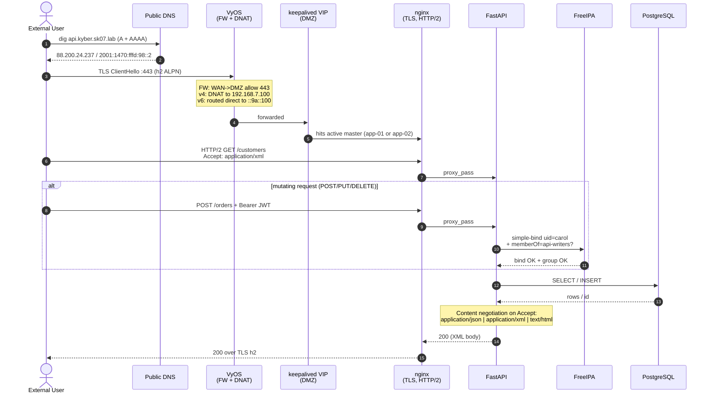

# kyber (sk07) — Network Diagrams

## 1. Physical & logical topology

Shows VMs, port groups, IPv4 + IPv6 addressing, the IPv6 prefix layout
(`2001:1470:fffd:98::/62` split into four `/64`s), and the VPN overlay.



### Prefix accounting (for the report)

| /64 prefix                  | Where it lives           | Why                                    |
|-----------------------------|--------------------------|----------------------------------------|
| `2001:1470:fffd:98::/64`    | WAN link to LRK          | Required by ISP routing entry          |
| `2001:1470:fffd:99::/64`    | INTERNAL (eth1)          | SLAAC - autoconfig for end users       |
| `2001:1470:fffd:9a::/64`    | DMZ (eth2)               | DHCPv6 stateful - fixed server addrs   |
| `2001:1470:fffd:9b::/64`    | NPTv6 outer (egress only) | Maps to inner ULA `fd07:7::/64`       |

Total: 4 of 4 `/64`s in the assigned `/62` are accounted for.

---

## 2. External REST API request - sequence

A walkthrough of one external `GET /customers` (and one mutating `POST /orders`)
landing on the API. Useful for the "data flow" section of the report and for
explaining the auth + content-negotiation requirements at a glance.



### What this diagram is evidence of (map to grading criteria)

| Requirement                            | Where it shows up in this flow                  |
|----------------------------------------|-------------------------------------------------|
| Split DNS                              | Step 1-2 (different answer than internal view)  |
| Firewall (WAN -> DMZ rules)            | Step 3 note                                     |
| TLS with real certs                    | Step 3 (ClientHello -> NGX)                     |
| HTTP/2                                 | Step 5 (h2 ALPN, h2 GET)                        |
| HA via keepalived                      | Step 4 (VIP)                                    |
| Content negotiation                    | Step 9 note                                     |
| LDAP-backed auth on protected ops      | "alt" branch                                    |
| Persistent DB                          | Step 7-8                                        |
| IPv6 reachability                      | Step 1-2 returning AAAA, step 3 v6 path note    |

---

## 3. Where to put these in the repo

```
/network/diagrams/
    README.md          <- this file
    topology.png       <- exported from section 1, for the PDF report
    topology@2x.png    <- 2x version for retina screens
    api-flow.png       <- exported from section 2
    api-flow@2x.png
```

Re-export every time the diagrams change. The Mermaid source above is the
authoritative version - the PNGs are derived artifacts.
